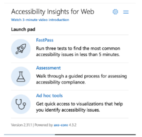

# Insufficient color contrast ratio

### Intro

Insufficient color contrast ratio is one of the most popular problems connected with accessibility. It may be problematic for people with different vision deficiencies (especially colorblind people) and makes text incomprehensible for them. Fortunately, this problem is quite well detected by automated tools.

### How to test your page against an insufficient color contrast ratio

There are many ways to test your webpage to detect problems with an insufficient color contrast ratio. Some of them you can find below

#### Lighthouse audit

* Open the Chrome browser and navigate to the page you want to test
* Use ctrl + shift + I on Linux/Windows or cmd + shift + I on Mac to open the Chrome DevTools panel,
* Go to the `Lighthouse` tab,
* Tick `Accessibility` checkbox,
* Decide which version (desktop or mobile) you want to test,
* Click the`Generate Raport`button.

The generated report will contain all a11y problems found on the page. If there are problems with contrast, they will be listed in the Contrast section (like on the screenshot below).

What is nice there is a list of failing elements. Each of them is clickable and navigates to the given element in the Elements tab in Chrome DevTools where you can easily experiment and fix it.&#x20;

#### CSS Overview via Chrome DevTools

Another way of finding all problematic items on the webpage is generating CSS Overview for the page (also using Chrome DevTools). To do so you need:

* Open the Chrome browser and navigate to the page you want to test
* Use ctrl + shift + I on Linux/Windows or cmd + shift + I on Mac to open the Chrome DevTools panel,
* Click 3 dots in the right top corner to open the menu
* Click `More tools` > `CSS Overview`
* Click `Capture overview` button

Problems with an insufficient color contrast ratio will be listed in the `Colors` section and `Contrast issues` subsection. Also here, after clicking the color preview, we'll receive a clickable list of failing elements. After clicking the list item we'll be redirected to the given element in the `Elements` tab in Chrome DevTools where we can easily experiment and fix the issue.

.png>)

#### Inspect element via Chrome DevTools

When you want to check only one element on the page you can just inspect it in the Chrome DevTools.

* Open the Chrome browser and navigate to the page you want to test
* Use ctrl + shift + I on Linux/Windows or cmd + shift + I on Mac to open the Chrome DevTools panel,
* Go to the `Elements` tab
* Click the Inspect icon (square with the cursor in the left top corner)
* Select the element you want to check
* Check the styling tooltip
* The orange icon with '!' next to the Contrast label means there are problems with the contrast of the given element

.png>)

#### Generate report via Accessibility Insights for Web tool

You can also use the Accessibillity Insights for Web tool to detect problems with the color contrast ratio on the page. You need to add an extension to your browser to perform the test. If you don't have the tool added to your browser read the [article](../useful-tools/web-insights-for-web.md) to learn how to setup it.

* Open the Chrome browser and navigate to the page you want to test
* Click the A11y for Web icon in the toolbar&#x20;
* Choose `Fast pass` option
* Check the results.

Detected problems with contrast will look like the screenshot below. You can use the link to learn more about the problem, highlight the failing element to easily find it on the page, or use a snippet to find the element to fix. Note that in the `How to fix` section you'll receive a new color which will fill the contrast criteria.

.png>)

### How to fix problems with color contrast

One of the ways to find a new color that meets the contrast criteria is using the Chrome DevTools. Inspect the problematic element in the Chrome DevTools and go to the `Styles` tab. Click on the square color preview on the left side of the color property value to open the color picker. Below the color value input, you may see an expendable section with contrast ratio information. The red icon close to the ratio informs us that we should take a look at that values. And reload button allows Chrome to automatically propose the new color — which will have a correct contrast ratio and be as close to ours as possible.

Another way of finding the new value may be using the Accessibility for Web tool. Perform the `Fast pass` check and read the `How to fix` section of the failing element. The new value of color should be included there.

### Example

Go to the page [https://github.com/dominika-zajac/a11y-for-developers-examples/tree/main/text-alternative](https://github.com/dominika-zajac/a11y-for-developers-examples/tree/main/text-alternative) and use the tools described above to find all elements with insufficient color contrast ratio on them.&#x20;

Note that automated tools didn't find the problem with the second button because an insufficient color contrast ratio is there only on hover. However, if you force to hover state on the element from the Chrome DevTools and inspect it manually, you can see that the problem exists.

.png>)

### Exercise

Find a new color value for the failing elements. Perform audits to confirm your fixes.

You can run the code:

* locally from GitHub ([https://github.com/dominika-zajac/a11y-for-developers-examples/tree/main/color-contrast](https://github.com/dominika-zajac/a11y-for-developers-examples/tree/main/color-contrast))
* in Stackblitz online editor (note that Lighthouse doesn't work in this setup): [https://stackblitz.com/github/dominika-zajac/a11y-for-developers-examples?file=color-contrast%2Fexample.html](https://stackblitz.com/github/dominika-zajac/a11y-for-developers-examples?file=color-contrast%2Fexample.html)
