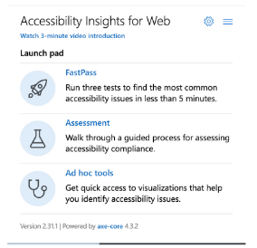

# Accessibility Insights for web

### Intro

Accessibility Insights for Web is a free extension for Chrome and Microsoft Edge browsers. It helps conduct manual and automated audits on the web pages.

### Installation

All you have to do is go to the webpage and click Add to Chrome or Add to Microsoft Edge button (depends on the browser you use). Personally, I recommend using the Chrome browser. After that, the new icon should be visible in your toolbar.&#x20;

### Using the tool

There are two primary scenarios supported by the tool: FastPass and Assessment. The third available section in the main menu is Ad hoc tools.

#### **FastPass**

FastPass is an automated audit after which you'll receive a list of failing elements on the webpage. The received report may look like the one visible in the screenshot below.

.png>)

Note, that you receive not only the list of problems but also a visual helper to easily find problematic elements on the page. You can also export results or start over the assessment. Each section is also extendable - you can find there more details about the problem, links to the articles describing how it should work, a list of failing elements, and instructions on how to fix the issue.&#x20;

.png>)

When you finish the automated audit you should also take a look at the Tab stops section. It helps you conduct a manual keyboard navigation check. The visual helper may be super useful to track the path on the page. And helper questions and a list of requirements guide you among all the items which should be verified.

.png>)

When automated audit and Tabs stops are checked open the `Needs review` tab and manually confirm some items from there. A list contains possible problems - issues that should be verified by a human.

#### Assessment

The `Assessment` section is super useful when you need to perform detailed manual testing. It's quite long so it's not performed after each merge request but e.g. before releasing a big feature or regularly e.g. once a month. It guides you among 24 categories and provides tips on what should be checked and how. There is also support for tracking progress, saving assessments, and exporting the results. In some cases, the tool will also provide a list of elements to test. All sections have great descriptions so I recommend you to just open and test them.

 (1).png>)

#### Ad hoc tools

The last section in the Accessibility Insights for Web tool is titled `Ad hoc tools`.  It's just a list of shortcuts for the most important items you should test and turn on/off the visual helpers for them.&#x20;

.png>)

&#x20;

